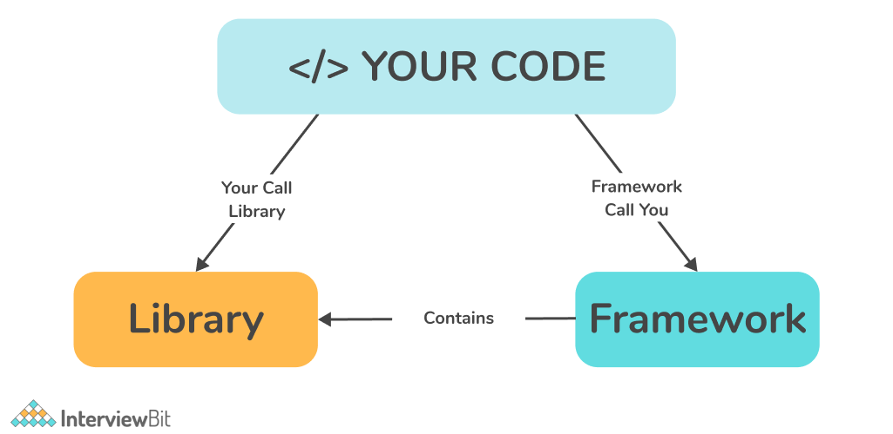

## Differentiate Library and Framework

-   `Inversion of Control` (who is calling whom) describes the key difference between a library and a framework.
-   By using a library, developer controls the flow of the program i.e., the developer calls library's code.
-   But in the case of a framework, the framework controls the flow i.e., the framework calls the developer's code.

## What is a CDN?

-   CDN stands for Content Delivery Network.
-   CDN is geographically distributed group of servers that caches content close to end users.
-   CDNs improve website load time by serving static content like images, videos, CSS, JavaScript files, etc. which also reduces the load on the original server.
